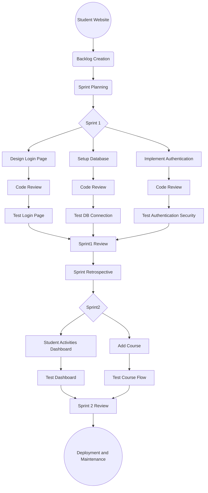

## 📌 Student Website Development - Agile Process

This project follows an **Agile methodology** to develop a **Student Website**, utilizing **sprints** for iterative development, testing, and deployment.

### 📊 Agile Workflow Diagram

---

### 🔹 Development Process  

#### 📍 **1. Backlog Creation**  
- Define the core features required for the **Student Website**.  

#### 📍 **2. Sprint Planning**  
- Identify tasks for each sprint cycle.  

#### 📍 **3. Sprint 1 - Core Features**  
✅ Design and Implement:  
   - **Login Page UI**  
   - **Database Setup**  
   - **User Authentication**  

✅ **Code Review & Testing:**  
   - Review Login, DB Setup, and Authentication.  
   - Test login flow, DB connection, and security vulnerabilities.  

✅ **Sprint 1 Review & Retrospective**  

#### 📍 **4. Sprint 2 - Advanced Features**  
✅ Implement:  
   - **Student Dashboard**  
   - **Course Management**  

✅ **Testing & Review:**  
   - Validate Dashboard UI & Course addition functionality.  
   - Sprint review and feedback incorporation.  

#### 📍 **5. Deployment & Maintenance**  
- Deploy the system on a cloud platform (e.g., Vercel, Firebase, Heroku).  
- Regular maintenance and feature updates.  

---

### 🚀 **How to Use**  
- Modify the **Mermaid diagram** based on project requirements.  
- Track sprint progress using Agile boards like **JIRA or Trello**.  
- Ensure continuous integration and deployment (CI/CD).  

📌 **Contribute:** Open for pull requests and improvements!  

---

### 🔗 **Author**  
Developed by **Chandra Prakash Bathula** | Passionate about **Agile & Web Development**  
